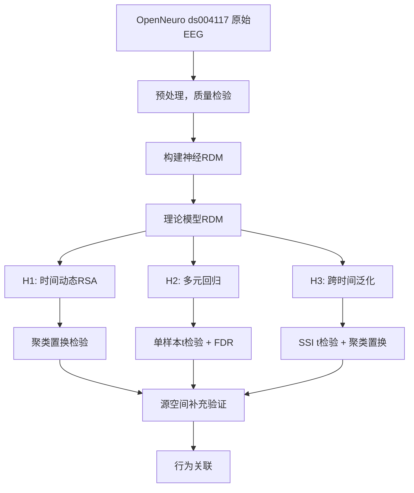
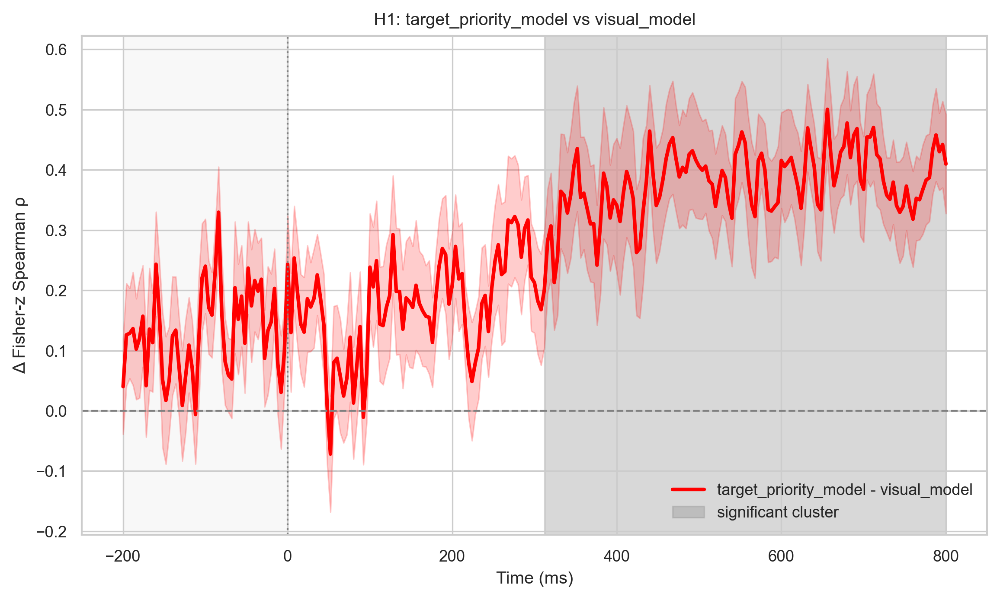
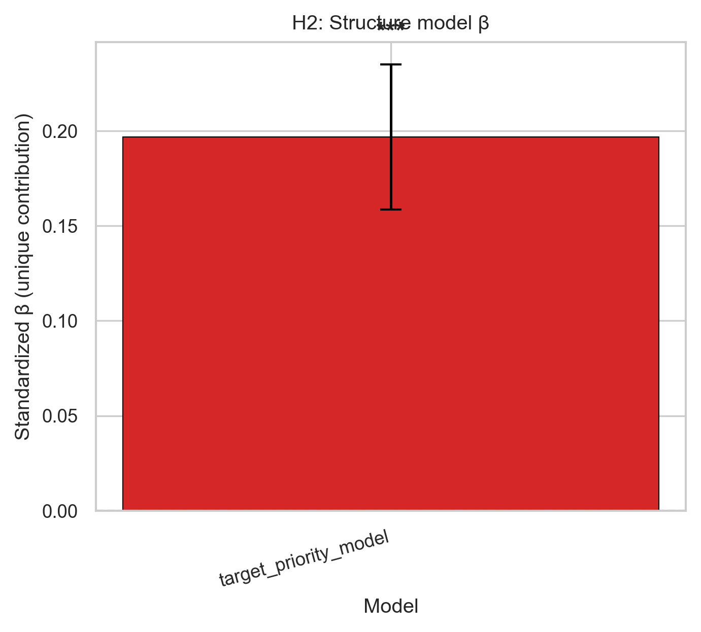
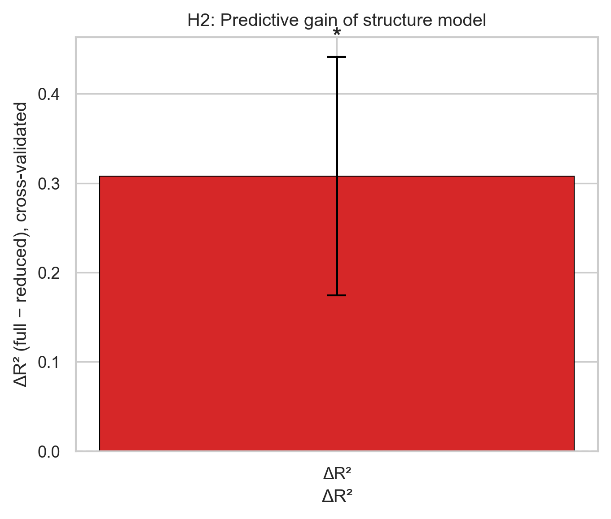
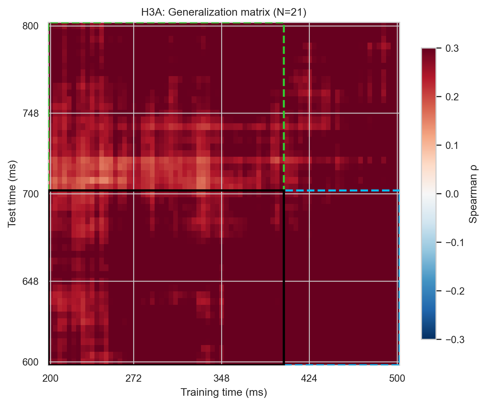
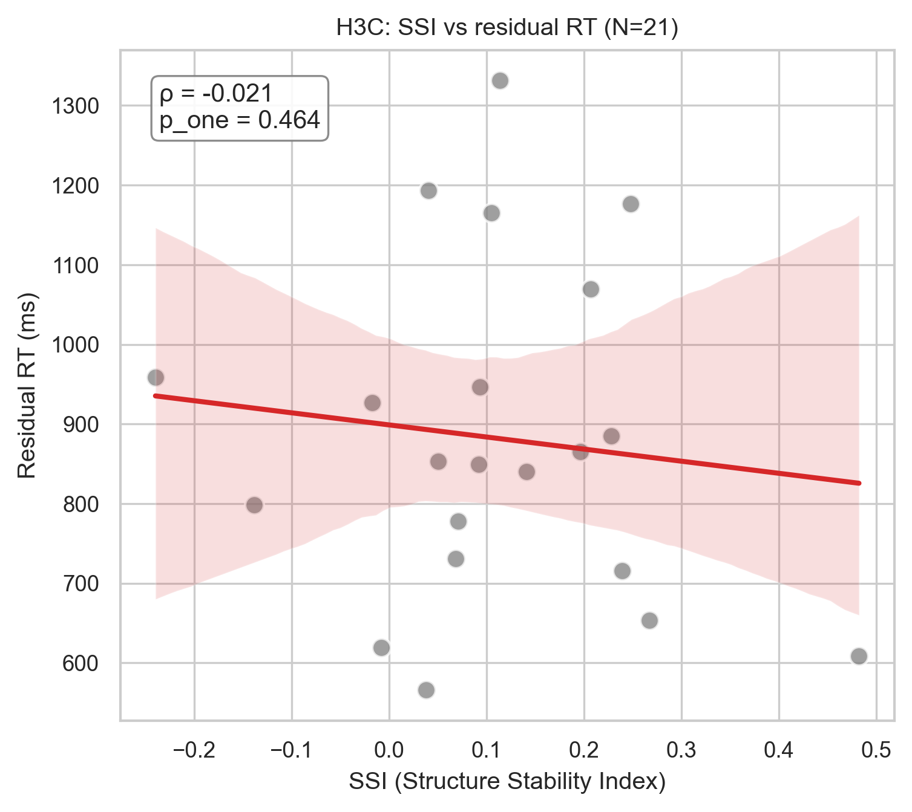

# 工作记忆中序列信息的神经表征动态：EEG-RSA 分析

> **Temporal Dynamics of Sequential Representations in Working Memory:  EEG-RSA Analysis**

邮箱：ElasWangLY@163.com
GitHub：https://github.com/ElasWang/wm_dynamics_rsa

基于公开脑电数据 **Sternberg Working Memory (OpenNeuro ds004117)**，独立完成预处理、RSA 建模、H1/H2/H3 统计与源空间验证，
研究大脑在工作记忆编码与维持的不同时间阶段，如何动态地分离、表征并重构序列结构与项目内容两种信息维度，并验证这种表征的行为相关性。

- 数据：21 名有效被试
- 分析框架：理论模型RDM → 神经RDM → RSA模型比较 → 时间动态聚类置换检验 → 源空间验证 → 行为关联
- 核心发现：**空间关系表征整体显著优于低级视觉特征表征，跨时间泛化优于视觉、颜色但未排除时间自相关。**

---

## 目录

- [1. 科学背景与假设](#1-科学背景与假设)
- [2. 方法](#2-方法)
- [3. 结果](#3-结果)
- [4. 目录结构](#4-目录结构)
- [5. 安装与依赖](#5-安装与依赖)
- [6. 运行流程](#6-运行流程)
- [7. 结论与局限](#7-结论与局限)
- [8. 数据来源与致谢](#8-数据来源与致谢)
- [9. 下一步计划](#9-下一步计划)
---

## 1. 科学背景与假设

工作记忆如何编码**顺序信息**是认知神经科学的核心问题。本研究检验以下三种假设：

| 假设 | 科学问题                    | 假说陈述 | 核心检验 |
|---|-------------------------|---|---|
| **H1** | 大脑是先做物理特征加工，还是直接抽象结构表征？ | 工作记忆表征由早期感觉表征逐渐转向晚期序列结构表征 | 结构/位置模型拟合相对于视觉及其他控制模型在时间上何时出现显著优势 |
| **H2** | **记住位置**是否必须依赖**记住字母**？ | 工作记忆能形成独立于具体内容的**抽象结构表征** | 控制视觉/内容/颜色后，结构模型是否仍有**独特贡献** |
| **H3** | 结构表征能否在维持期稳住？撑得越稳反应越快吗？ | 抽象结构表征具有**跨时间持续性**，且稳定性与个体工作记忆表现相关 | 结构表征是否跨时间保持，并与行为表现相关 |

### 主要理论模型(全部模型见src/shared_utils/models/model.md)

#### 1. 目标优先重索引模型 target_priority_model
- 特征构造：位置根据刺激呈现时序，黑色记忆字母按出现顺序赋值；绿色干扰位置赋值0；颜色通道：黑色=1，绿色=0
- 距离度量：绝对值差
- 使用场景：H1主分析、H2多元回归、H3跨时间泛化

#### 2. 位置梯度模型 gradient_model
- 特征构造：不区分黑/绿，仅依据刺激出现的时序位置赋值
- 距离度量：欧氏距离
- 使用场景：H1敏感性分析、H2/H3替换结构模型做敏感性检验

#### 3. 视觉相似性模型 visual_model
- 特征构造：基于字母行为混淆矩阵得到的视觉特征向量
- 距离度量：基于混淆矩阵的表征距离
- 使用场景：H1，H2，H3通用低级感知控制模型

#### 4. 内容身份模型 content_model
- 特征构造：**27维独热编码空间**
  - 维度 1‑26：A‑Z字母独热编码，条件出现的对应字母维度置1，其余为0
  - 第27维：Distractor干扰项；**所有绿色忽略字母此维度置1，不再使用对应字母独热维度**
- 逻辑：仅编码字母身份与是否为干扰项；完全不包含序列位置、时序关系信息
- 距离度量：欧氏距离
- 使用场景：**H2多元回归RSA核心竞争预测变量**；用于在剥离字母内容身份方差之后，检验序列结构是否还存在独特神经解释力
- **注意**：模型维度高，计算RDM后做Z‑score标准化，避免尺度干扰回归系数。
**敏感性备选**：替换为字母视觉混淆矩阵作为内容表征，用于结果鲁棒性检验。

---

## 2. 方法



### 分析粒度

| 版本        | 后缀 | 说明               |
|-----------|---|------------------|
| 事件级       | `_event` | 事件级 RDM，敏感性分析    |
| 条件级       | `_cv` | 条件级 RDM，主分析      |
| 源空间条件级    | `_source_cv` | 源空间补充验证条件级 RDM ,排除体积传导 |

### 统计方法

- H1：逐时间点 Fisher-z 差分；单样本聚类置换检验
- H2：5 折交叉验证 Ridge 回归；β 和 ΔR² 单样本单侧 t 检验
- H3：SSI 单样本单侧 t 检验；结构 vs 控制配对 t 检验；SSI(t) 聚类置换；SSI 与行为 Pearson 相关

---

## 3. 结果

> 全部结果基于 **N = 21** 名有效被试。方向 `A > B` 表示前一模型拟合显著高于后一模型。


### 3.1 H1：结构表征随时间反超视觉表征 

**结论：** 部分支持。 条件级与源空间均出现显著晚期簇，但事件级簇过宽且含刺激前假阳性。

| 对比                               | 粒度           | 显著簇（ms） |    p 值 | 方向    |
| -------------------------------- | ------------ | ------: | -----: | ----- |
| `target_priority > visual`       | `_event`     | 152–224 | 0.0296 | A > B |
|       |     | 232–380 | 0.0022 | A > B |
|       |     | 604–800 | 0.0012 | A > B |
|       | `_cv`        |    0–68 | 0.0318 | A > B |
|       |   |  80–708 | 0.0002 | A > B |
|       | `_source_cv` | 312–800 | 0.0002 | A > B |
| `gradient > visual`              | `_event`     | 236–532 | 0.0026 | A > B |
|            |     | 612–800 | 0.0090 | A > B |
|            | `_cv`        |    0–68 | 0.0276 | A > B |
|            |       |  76–736 | 0.0002 | A > B |
|            |       | 744–800 | 0.0436 | A > B |
|            | `_source_cv` | 180–216 | 0.0478 | A > B |
|            | | 240–800 | 0.0002 | A > B |
| `reciprocal_adjacency > visual`  | `_event`     | 236–564 | 0.0028 | A > B |
|   |   | 608–800 | 0.0084 | A > B |
|   | `_cv`        |    0–68 | 0.0282 | A > B |
|   |       |  76–736 | 0.0002 | A > B |
|   |       | 744–800 | 0.0436 | A > B |
|   | `_source_cv` | 180–216 | 0.0492 | A > B |
|   | | 236–800 | 0.0002 | A > B |
| `target_priority > binary_color` | `_source_cv` | 460–492 | 0.0436 | A > B |
|  |  | 500–532 | 0.0428 | A > B |
|  |  | 580–624 | 0.0318 | A > B |

> - target_priority > binary_color 仅在源空间出现晚期小簇（460–624 ms），说明结构模型在排除简单颜色分类后仍有微弱独特优势。
> - gradient > timestamp 在所有粒度均无显著簇——无法排除结构拟合优势来自 EEG 普遍时间自相关。
> - 条件级（_cv）出现 0–68 ms 刺激前簇，可能是假阳性或基线噪声

<p align="center">

<br>
  <sub><em>图 1. 源空间条件级 RSA：目标优先重索引模型 vs 视觉模型。312–800 ms 显著簇（p = 0.0002）。</em></sub>
</p>

### 3.2 H2：结构模型的独特贡献 

**结论：** 条件级支持，事件级与源空间非常不稳健。 在控制内容、视觉、颜色后，结构模型仅在条件级（_cv）表现出显著独特贡献。

| 粒度           |         Structure β |         t |            p |       ΔR² Structure |         t |          p |
| ------------ | ------------------: | --------: | -----------: | ------------------: | --------: | ---------: |
| `_event`     |     0.0235 ± 0.0139 |     1.694 |       0.0529 |     0.0012 ± 0.0010 |     1.225 |     0.1174 |
| `_cv`        | **0.1968 ± 0.0383** | **5.141** | **< 0.0001** | **0.3078 ± 0.1336** | **2.304** | **0.0160** |
| `_source_cv` | **0.0990 ± 0.0277** | **3.574** |   **0.0009** |     0.2955 ± 0.1903 |     1.553 |     0.0680 |

> - **条件级（_cv):** 结构模型 β 显著 > 0，且加入结构后 ΔR² 显著提升，支持结构-内容分离假说。 
> - **事件级（_event）:** 结构 β 边缘不显著（p = 0.053），ΔR² 不显著，说明事件级噪声较大，独特贡献被稀释。 
> - **源空间（_source_cv）:** 结构 β 显著，但 ΔR² 仅边缘显著（p = 0.068），预测精度提升有限。

<p align="center">

<br>
  <sub><em>图 2. 条件级多元回归：结构模型 β 显著 > 0（β = 0.197, p < 0.0001）。</em></sub>
</p>
<p align="center">

<br>
  <sub><em>图 3. 加入结构模型后 ΔR² 显著提升（ΔR² = 0.308, p = 0.016）。</em></sub>
</p>


### 3.3 H3：结构表征的跨时间稳定性

**结论：** 部分支持。 结构泛化在条件级与源空间显著优于视觉和颜色，但未显著优于时间戳，无法完全排除时间自相关。

| 粒度           |      SSI mean ± SEM |         t |      p (one) | vs Visual (p) | vs Color (p) | vs Timestamp (p) |        结构平均拟合 (p) |
| ------------ |--------------------:|----------:|-------------:|--------------:|-------------:| ---------------: | ----------------: |
| `_event`     |     0.0019 ± 0.0019 |     0.998 |       0.1651 |        0.0018 |       0.4024 |           0.6339 |   0.0067 (0.0002) |
| `_cv`        |     0.1083 ± 0.0332 |     3.263 |       0.0019 |        0.0001 |       0.0211 |           0.9964 |   0.2216 (0.0001) |
| `_source_cv` |     0.1649 ± 0.0288 |     5.721 |     < 0.0001 |        0.0000 |       0.0020 |           0.7408 | 0.2479 (< 0.0001) |

> - SSI 在条件级与源空间显著 > 0，表明结构泛化确实超出低级视觉与颜色特征的平均拟合。
> - 但 vs Timestamp 在所有粒度均不显著（p > 0.63），说明结构泛化优势可能部分来自 EEG 普遍时间自相关，无法完全排除。
> - 事件级（_event）SSI 不显著，与 H2 一致，说明事件级信噪比不足

<p align="center">

<br>
  <sub><em>图 4. 条件级跨时间泛化矩阵：编码期 → 维持期。</em></sub>
</p>
<p align="center">

<br>
  <sub><em>图 5. SSI 与行为（RT/ACC）的被试层面相关（N = 21）。</em></sub>
</p>
---

## 4. 目录结构

```
.
├── config/
│   └── global_config.yaml                # 全局配置文件
│
├── run.py                                # 流水线入口文件
│
├── data/
│   ├── derivatives/                      # 预处理EEG数据
│   └──raw/                               # EEG源文件
│
├── src/
│   ├── pipeline1_empirical_rsa/
│   │   ├── core/
│   │   │    ├── h1_analysis.py            # H1：时间动态RSA + 聚类置换检验
│   │   │    ├── h2_analysis.py            # H2：多元回归 + 交叉验证
│   │   │    ├── h3_analysis.py            # H3：跨时间泛化 + SSI + 行为关联
│   │   │    ├── preprocess_engine.py      # EEG数据预处理
│   │   │    ├── source_rsa_engine.py      # 源级RDM加载
│   │   │    └── sensor_rsa_engine.py      # 神经RDM加载、泛化矩阵、上三角提取
│   │   └── visualization/                 # 生成图表
│   │──shared_utils/
│   │  ├── models/                        # 理论模型注册与实例化
│   │  └── plotting/                      # 绘图工具（styles / helpers）    
│   └── scheduler/ 
│      ├── batch.py                       # 流水线批量执行逻辑
│      ├── executor.py                    # 流水线执行器
│      ├── registry.py                    # 流水线注册列表
│      └── utils.py                       # 执行工具
│
├── results/
│   ├── rsa/                          # 群体统计报告
│   ├── rsa/sub-***                   # 单被试神经RDM与模型RDM计算结果
│   ├── figures/group/                # H1-H3 群体图
│   ├── rdms/model/                   # 模型RDM缓存
│   └── rdms/neural/                  # 神经RDM缓存
└── README.md
```

---

## 5. 安装与依赖

```bash
pip install -r requirements.txt
```

Python ≥ 3.9

---

## 6. 运行流程

```bash
python run.py

```

---

## 7. 结论与局限

### 支持证据
| 假设     | 支持程度      | 关键证据                             | 
| ------ | --------- | -------------------------------- |
| **H1** | **部分支持**  | 条件级与源空间出现晚期显著簇（结构 > 视觉），源空间效应更干净 |
| **H2** | **条件级支持** | 条件级 β 与 ΔR² 均显著，控制协变量后结构仍有独特贡献   | 
| **H3** | **部分支持**  | 条件级与源空间 SSI 显著 > 0，结构泛化优于视觉/颜色   |

### 局限与未决问题

- **时间自相关未完全排除：** H1 中 gradient > timestamp 在所有粒度均无显著簇；H3 中结构泛化未显著优于时间戳模型。目前没有完全排除“结构效应来自 EEG 普遍时间自相关”的替代解释。
- **模型共线性：** 目标优先、梯度、邻近性模型的 RDM 高度相关，效应高度重合，无法支持某一特定模型最优的强假设。。
- **事件级信噪比不足：** 事件级（_event）RSA 出现刺激前假阳性与超宽簇，H2 回归中结构 β 边缘不显著（p = 0.053），ΔR² 不显著。
- **源空间定位精度有限：** 缺少个体 MRI，源重建使用 fsaverage 标准模板，空间精度受限，无法进行精细的 ROI 定位。
- **样本量有限：** N = 21，H3行为相关分析的统计效力有限，个体差异可能掩盖群体效应。
- **H2 仅在条件级成立：** 结构独特贡献在条件级（_cv）显著，但在事件级（_event）与源空间（_source_cv）非常不稳健。源空间 ΔR² 仅边缘显著（p = 0.068），提示预测精度提升有限。
- **条件级刺激前假阳性：** 条件级（_cv）在 0–68 ms 出现显著簇，可能为假阳性或基线噪声。
---

## 8. 数据来源与致谢

- 公开数据：**Sternberg Working Memory (OpenNeuro: ds004117)**，数据包含带颜色干扰字母序列的 Sternberg 工作记忆任务 EEG 记录。
- 分析实现：本仓库全部代码（预处理、RDM 构建、RSA 模型比较、统计检验、可视化）。
- 若使用本仓库结果，请引用数据源：OpenNeuro ds004117。

## 9. 下一步计划

### Study 1：实证 EEG 表征相似性分析收尾

| # | 任务 | 目的                                                 |
|---|---|----------------------------------------------------|
| 1 | **时间自相关证伪**：temporal-distance matched control / shuffled null | 排除**泛化优势来自 EEG 普遍时间自相关**的替代解释，确认 structure-specific |
| 2 | **H2 稳健性**：模型共线性诊断（VIF / 正交化） | 解释独特贡献为何仅在条件级成立              |
| 3 | **源空间 ROI 分析**：DMN / FPN / Visual 三 ROI 的时间动态 RSA | 从头皮表征定位到脑区，排除体积传导                                  |
| 4 | **动态加权混合模型**：扫描 α, λ 组合，输出 α(t) 结构-内容权重漂移曲线 | 机制化探索：表征资源如何随时间动态调配                                |

### Study 2：仿真模拟 — RSA流水线的方法学验证（补充验证研究）

用**模拟数据反向推断认知计算参数**，证明 RSA 不只是统计相关，而是可量化心理过程的测量工具：

1. **参数扫描（Sigmoid 曲线）**：序列依赖强度 λ ∈ [0.1, 0.9]，绘制 RSA 相似度随 λ 变化的 S 形曲线——验证 RSA 指标能解码底层计算参数的微小变化；
2. **模型辨别力（混淆矩阵）**：生成两组数据（A=边界强化机制 λ_边界=0.8；B=位置梯度机制 λ_梯度=0.8），喂入Study 1管道后做机制判别，对角线准确率 >80% 即证明管道能反向推断认知策略；
3. **逼真噪声**：加入真实 EEG 的 1/f 粉色噪声与空域协方差矩阵（从静息态估计），避免"理想化模拟"；
4. 重点观察**延迟期（维持期）**的 λ 效应分化度。

### Study 3：可解释循环神经网络生成式建模（探索性拓展研究，未来工作）

用可解释 RNN 在**延迟匹配样本（DMS）**任务上复现工作记忆的神经动态，与Study 1实证数据对接：

1. **任务对齐 DMS**：输入样本序列（4–6 个字母，LSTM 编码器）→ 延迟期 → 探针 → 匹配/不匹配二分判断；
2. **隐状态轨迹**：PCA 降维延迟期隐状态，若出现"环状吸引子"式旋转轨迹，对应神经科学的持续性放电机制；
3. **RNN-EEG 跨尺度关联**：RNN 隐状态 PC1 时间序列 × 真实 EEG 额叶中线（Fz）θ 功率，DTW / 皮尔逊相关——即使不显著也给出分析思路（跨尺度建模意识）；
4. **RNN 人工 RDM ↔ 真实神经 RDM**：延迟期隐状态计算 1−Pearson RDM，与真实 EEG 延迟期 RDM 做相关，检验是否**额叶特异**（对应 RNN 决策单元）；
5. **消融实验**：切断 RNN 循环连接（→ 前馈），若 RDM 相关消失，则证明**循环动态是工作记忆表征的核心机制**——直接对应Study 1"结构-内容分离"的晚期效应；
6. **正则化 RNN**：损失函数加"神经代价"（惩罚延迟期隐状态剧烈变化），模拟大脑能量最小化原则。

### 9.4 整体计划

```
Study 2（模拟验证 RSA 方法） → Study 1（实证：结构/内容表征动态）    → Study 3（RNN 机制复现）
         ↑                                ↓                           ↑
         └────────────  神经 RDM × RNN RDM 跨尺度相关 + 消融  ───────────┘
```
```mermaid
flowchart TD
    A[神经 RDM × RNN RDM 跨尺度相关 + 消融 ] 
    A --> B[Study 2（模拟验证 RSA 方法）]
    [Study 1（实证：结构/内容表征动态）]C --> A
    A --> D[Study 3（RNN 机制复现）]
    B --> C
    C --> D


```
